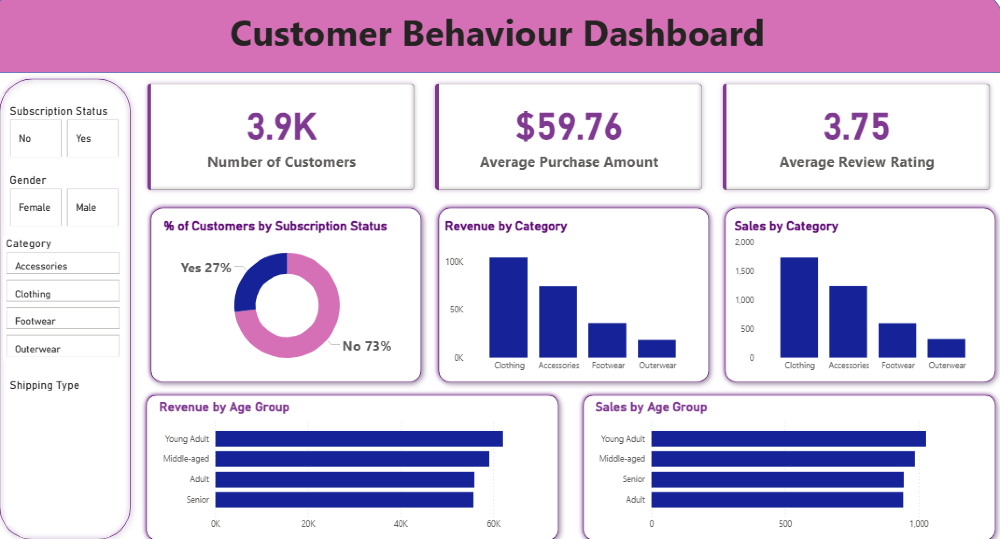

Customer trends Behavior Analysis

📌 Overview

This project analyzes customer shopping behavior using a dataset of 3,900 customer transactions. 
The objective is to identify purchasing trends, customer segments, product performance, and 
subscription patterns that support data-driven business decisions.

The project combines Python for data cleaning and transformation, SQL for business analysis,
and Power BI for interactive dashboard development to generate actionable business insights.

🛠️ Tools & Technologies

* Python
* SQL
* Power BI
* Microsoft Excel

📂 Dataset Information

* 3,900 Customer Transactions
* 18 Features
* Customer Demographics
* Product & Purchase Information
* Subscription Status
* Discounts & Promotions
* Review Ratings

🔄 Data Preparation

* Data Cleaning and Validation
* Missing Value Handling
* Feature Engineering
* Data Transformation
* Data Analysis using SQL Queries

📊 Key Analysis

* Revenue Analysis by Gender and Age Group
* Customer Segmentation (New, Returning, Loyal)
* Subscriber vs Non-Subscriber Comparison
* Product Performance Analysis
* Discount Impact Analysis
* Shipping Type Analysis

📈 Dashboard Features
* Revenue KPIs
* Customer Segmentation Insights
* Subscription Analysis
* Product Performance Metrics
* Interactive Filters and Slicers


📸 Dashboard Preview



🚀 Project Outcome

Developed an end-to-end analytics solution that transformed raw customer transaction data into meaningful business insights, 
enabling better decision-making through data visualization and analysis.

📁 Repository Structure

```text
Customer-Shopping-Behavior-Analysis
│
├── customer_shopping_behavior.csv
├── Customer_Shopping_Behavior_Analysis.ipynb
├── customer_behavior_sql_queries.sql
├── customer_behavior_dashboard.pbix
├── Customer_Shopping_Behavior_Analysis.pptx
├── Customer_Shopping_Behavior_Analysis.pdf
├── Business_Problem_Document.pdf
├── dashboard.jpg
└── README.md
```


📌 Author

Shrijit Talwatkar

📧 Email: shrijittalwatkar@gmail.com

🔗 LinkedIn: http://www.linkedin.com/in/shrijit-talwatkar

🔗 GitHub: https://github.com/shrijit-talwatkar
